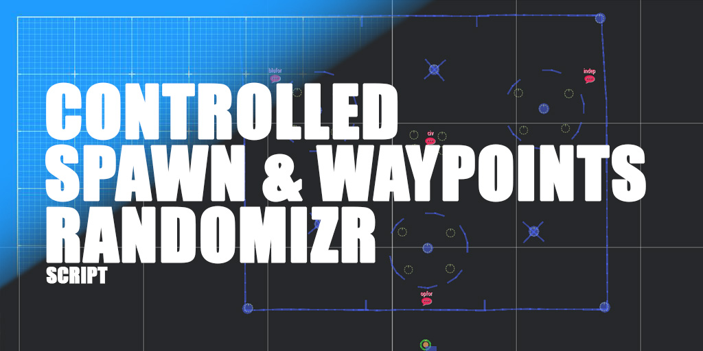

# Arma 3 / CSWR: Controlled Spawn & Waypoints Randomizr v7.2
>*Dependencies: none.*

CSWR is an Arma 3 script that allows you to spawn AI groups and vehicles how and wherever you want, making them automatically move through the easily defined map regions without the need for scripting knowledge. CSWR almost doesn't change original AI behaviors, saving server performance and Arma 3 integrity.

Special thanks: To the old (but gold) "T8 Units" script for the inspiration over the years.

## HOW TO INSTALL / DOCUMENTATION

Video demo: https://www.youtube.com/watch?v=gcnvC2-qAFs

Video tutorials: https://www.youtube.com/playlist?list=PL9C3CUvV0NhM0HspcB9ajPNBj9lLy3ozN

Documentation: https://github.com/aldolammel/Arma-3-Controlled-Spawn-And-Waypoints-Randomizr-Script/blob/main/_CSWR_Script_Documentation.pdf

__

## QUICK START

**Steps for Basic Editors:**
1 - Download and open the documentation;
2 - Install the script (10 seconds);
3 - Turn "TRUE" which side(s) CSWR takes care;
4 - Define how many groups and vehicles should be spawned;
5 - On the map, drag and drop the markers for spawns and destinations;
6 - Play.

**Extra steps for Advanced Editors:**
- Which language and ethnicity does the side belong to;
- Define when each group/vehicle should spawn;
- Customize the loadout of infantry, marines, snipers, and heavy crew;
- Define the list of forbidden items that AI cannot have;
- And more.

## SCRIPT DETAILS

**What to expect:**
- No dependencies from other mods or scripts;
- Run flawlessly for multiplayer and single-player missions;
- Manually set which markers the side can use as spawn-points;
- Create unlimited and different types of spawn-points:
- Infantry Spawn-points;
- - Marines Spawn-points; **_NEW_**
- - Ground vehicle spawn-points;
- - Nautical and amphibious spawn-points; **_NEW_**
- - Helicopter spawn-points;
- - Air Paradrop for vehicle spawn-points;
- - Air Paradrop for people spawn-points;
- Spawn-points can be triggered by:
- - Mission starts;
- - Trigger activation;
- - Timer;
- - Target status;
- There is no re-spawn. Death is death for units and vehicles spawned by CSWR;
- Create unlimited and different types of destinations:
- - Move Restrict;
- - Move Public;
- - Move Any;
- - Nautical Move Restrict; **_NEW_**
- - Nautical Move Public; **_NEW_**
- - Nautical Move Any; **_NEW_**
- - Move Watch;
- - Move Hold;
- - Move Occupy;
- Set which vehicles a side will use (including helicopters and boats);
- Set which units (regardless of the faction or side) a side will use;
- Set how large is each group-type of a side;
- Customize the loadout of different roles of the same side:
- - Infantry;
- - Snipers;
- - Paratroopers;
- - Crewmen;
- - Marines; **_NEW_**
- Set those segments of a side can use Night-vision-Goggles:
- - Only Infantry;
- - Only Snipers;
- - Only Paratroopers;
- - Only Marines; **_NEW_**
- - All of them;
- - No one;
- - Set if a side has Flashlights as an alternative for Night-visions;
- Deeper customization:
- - Side ethnicity; **_NEW_**
- - - Automatic faces selection;
- - - Automatic language selection;
- - Language manual customization; **_NEW_**
- Set what behavior each group and vehicle start the game:
- - Safe;
- - Aware;
- - Combat;
- - Stealth;
- - Chaos;
- Set if all vehicles and units spawned by CSWR should be editable by Zeus;
- Set if the CSWR should wait for another script load first on the server;
- Debugging:
- - Friendly error handling;
- - Hint monitor to control some AI numbers;
- - Full documentation is available.

__

## IDEA AND FIX?

Discussion and known issues: https://forums.bohemia.net/forums/topic/237504-release-controlled-spawn-and-waypoints-randomizr/

__

## CHANGELOG

**Jan, XXth 2025 | v7.2**
- 
- 
- Documentation has been updated.

**Dec, 29th 2024 | v7.0**
- **IMPORTANT 1:** from now and so on, the sector-letter is needed (not an option anymore) in spawns and destinations. Example of spawn, from 'cswr_spawn_blu_1' to 'cswr_spawn_blu_A_1';
- **IMPORTANT 2:** from now and so on, vehicles are not allowed to spawn through infantry spawn-points. Vehicles should use only 'spawnveh' or 'spawnheli' or 'spawnparadrop';
- Added > Spawn type > Support to nautical spawns, allowing spawn boats and other nautical vehicles, including ground vehicles with amphibious ability;
- Added > Identity > Select the ethnicity each side represents, changing their faces and language automatically: Africa, Asia, Europe, Eastern Europe, Mid-East, North America, South America;
- Added > Option to turn off the entire script through the management file, no need to touch the description.ext anymore;
- Improved > Marines > Now, all infantry that spawn in water is converted automatically to a marine that has its own loadout if the editor customized that in 'fn_CSWR_loadout.sqf' file;
- Improved > How each group/vehicle chooses its 'time breaking' before each new waypoint;
- Improved > The spawn-points feedback when dropped in inappropriate places (ground vehicle spawns too far away from the shore);
- Improved > Paradrop > Now you can control the spreading (radius) of parashooters and vehicles falling from the sky where the minimal spreading is 200 meters and the default is 500;
- Improved > Paradrop > Rock mountains > If a parashooter leader falls over a rock, CSWR manages to reposition them in a safe ground aside where they will wait for the group members to regroup;
- Improved > Paradrop > Rock mountains > If a parashooter member gets stuck or too late to regroup their leader position, after a while (editable), CSWR teleports the unit to the leader position;
- Improved > Paradrop > Water/sea > If a parashooter leader falls into the water, CSWR manages to reposition them in near the coast where they'll wait for the group members to regroup;
- Improved > Paradrop > If a leader dies during the regroup waiting, CSWR transfers the waiting responsibility to the new group leader if applicable;
- Improved > Amphibious vehicles (e.g. APC) can only spawn in water and move to the land, but no longer move in move-markers IN the water, preventing accidental disengaging;
- Improved > Helicopters > If it's spawned in water, the helicopter automatically starts its mission hovering;
- Improved > Helicopters > The crew now is using the custom infantry uniform too, but without changing helmet and/or goggles;
- Improved > Destinations > Now, each group/vehicle has its own waypointCompletionRadius each new destination, making units and vehicles more spread out when simultaneously in the same place;
- Improved > init.sqf file updated;
- Improved > A bunch of performance improvements;
- Improved > fn_CSWR_population.sqf > Group variable names have been changed to be more readable/easy to understand;
- Improved > Even more debug and warning feedback;
- Fixed > Single player > Before, if you turned off the Debug mode and tried to run a single-player game, an error about CSWR_prefix was printed out;
- Fixed > Markers > If editor has a typo in some marker prefix ("cswr_") the script tells them correctly;
- Fixed > Paradrop > An issue where paradropped vehicles would sometimes lose their balance and flip over in mid-air, causing the crew's death or the vehicle to crash upon landing;
- Fixed > Spawn delay > The bug that a group doesn't spawn if the editor sets the spawn-delay-timer to 0 (zero) minutes. Now zero and negative numbers are ignored;
- Fixed > Destinations > If all hold-destinations are booked, tracked-vehicles were traveling through the map instead of taking a peripherical position onto booked hold-position;
- Fixed > Group behavior > Some infantry groups (when their behavior were "SAFE") were not in diamond formation, which is mandatory for infantry executing hold-position;
- Fixed > Helicopters > If a chopper needs repair/rearm/refuel/heal but no land-helicopter-spawn available, now the helicopter ignores the RTB necessity and fights 'til death;
- Tweaked > Snipers > Now, if you turn (e.g.) CSWR_canNvgSnipersBLU to "false", no matter if the sniper group is part of paratroopers that NVG is allowed, the sniper group won't receive NVG anymore;
- Tweaked > Helicopters > When the helicopter spawn landed, now it will turn the engine immediately but it still has a cooldown before take-off;
- Tweaked > Helicopters > Light class ones have a new default operational altitude (from 150 to 300 meters of altitude);
- Tweaked > Helicopters > Heavy class ones have a new default operational altitude (from 300 to 600 meters of altitude);
- Removed > Paratroops > Goggles are not a mandatory gear anymore;
- Documentation has been updated.

**Apr, 14th 2024 | v6.5.2**
- Script folder structure modified to make the installation easier, including a clean configuration in loadout and population files.
- Documentation has been updated.

**Dec, 1st 2023 | v6.5.1**
- HOTFIX > A rare error: when the mission editor dropped common move markers to a side but they also chose to disable that side, the remaining groups from other sides using "_move_ANY" command could try to use those disabled markers, never finding those positions;
- Fixed > Removed the Jets DLC dependency in the mission example;
- Improved > Watch > You can choose 3 different levels of accurance for sniper groups using Watch destinations (Recruit, Veteran, Expert);
- Improved > General > You can force the units by foot to use flashlights On all the time;
- Documentation has been updated.

**Nov, 27st 2023 | v6.5**
- Fixed > Sectorizing > Now is forbidden to sectorize the movement "_move_ANY" because it doesn't make sense at all;
- Fixed > Occupy > When the mission editor hid a building, the group still considered that building as a possible location to occupy;
- Fixed > Occupy > An error (caused only in v6.0) when the group leader kicked an unit out of the group if the unit was too far from them;
- Improved > Occupy > Now groups are able to occupy big towers like Military Cargo Towers;
- Improved > Occupy > If the building is a ruin, and its type is an accepted one, the group when into it will stay in a crouch to units get a lower profile on it;
- Improved > Occupy > Expanded the amount of forbidden buildings and acceptable ruins based of Western Sahara DLC map;
- Improved > Occupy > Expanded the amount of forbidden buildings and acceptable ruins based of Global Mobilization DLC maps;
- Improved > Occupy > If a building is badly added by Editor as forbidden and acceptable building at the same time, CSWR in debug mode will point this;
- Improved > Watch > Watch logic was totally overhauled, making the watch-destination more feasible and reliable in wild and urban environments;
- Improved > Watch > Sniper groups can set positions in urban places too as a secondary approach;
- Improved > Watch > Minimal range to sniper group sets watching position was increase from 100 to 200m;
- Documentation has been updated.

**Nov, 14th 2023 | v6.2**
- Fixed > Ocuppy > Occupy-destination-markers weren't working fine when they were sectorized;
- Fixed > Missions with respawn system applied were hidden CSWR markers even when debug mode was True (init.sqf updated);
- Fixed > When a group (spawned in a sectorized spawn) assigned with _move_ANY destination command without sector declared to destination too, an error was printed out;
- Improved > Watch > Now, if the sniper group doesn't find any peak or hill, they will search for secondary high places (mounts);
- Improved > Waiting time for the next vehicle spawn when it's been used spawn delay for that decrease from 10 to 1 second;
- Improved > Unit classnames from other sides are accepted and converted automatically to the mission editors' side choice;
- Hotfix 11th > Fixed a typo in "fn_CSWR_globalFunctions.sqf" (line 3587) that was printing out an error specific if only sectorized spawns were dropped on the map, without any non-sectorized ones (Thanks to reporting, VR_NotKilled);

**Oct, 25th 2023 | v6.0**
- Added > Markers scan > Now CSWR knows how to sectorize spawns and destinations, so Editor can define which groups and vehicles must consider those sectors or not;
- Added > Vehicles > When a vehicle's lost but its crewmen survive, if allies are close, the crew will join them, taking their mission to themselves;
- Fixed > Paradrop > Civilian parachuters are landing without stuck in crouched position (panic);
- Fixed > Debug > Small fix about marker message's examples;
- Fixed > Occupy > Vehicles configured to use Occupy-move markers were able badly to try to occypy a building;
- Improved > Helipcoter > Besides the regular move to the waypoint, now helicopter has 33% of chance to approach the current waypoint with Seek & Destroy style;
- Improved > Hold > Small improvement during the hold maneuver validation when solid objects around and group leader is out of the vehicle;
- Improved > Hold > Civilian tracked-vehicle cannot booked center marker position anymore as a tank or trackedAPC;
- Improved > Destinations > All infantry and vehicles are able to restore their waypoints (doing a new search) if they are accidentally deleted;
- Improved > Markers scan > Small improvements;
- Documentation has been updated.

**Oct, 11th 2023 | v5.5**
- Added > Spawn for helicopters can be set over the ship floors or platforms in water. Check the documentation;
- Added > All infantry soldiers and paratroopers can get easily flashlights on their rifles when the editor desactivates their night-vision-goggles;
- Improved > All CSWR markers are invisible since the Briefing screen (init.sqf file has been included in project);
- Improved > New method (more feasible to performance) to check if destinations and spawn-points are busy before accept new groups/vehicles, avoiding accidental explosions;
- Improved > Loadout > New method to build custom loadouts (more flexible and intuitive);
- Improved > Loadout > The global options to force apply backpack and/or vest for all units now will ignore civilian faction;
- Improved > Hold > New method to turn the tracked vehicle to hold-marker direction even more accurate and safe (against vehicle bounces);
- Improved > Hold > When in debug-mode-global is TRUE with debug-hold-mode is also TRUE, now the hold-markers and its direction are visible to the Mission Editor in-game;
- Improved > Spawn delay > from now the spawn delay timer is configured in-minutes and not in-seconds anymore, making the Mission Editor's life easier;
- Improved > Loadout > Now it's possible to turn On or Off which faction will get nightvision and what nightvision device model (supports NVG from mods too);
- Improved > Loadout > Ue the "RANDOM" command in civilian uniform slot in loadout file to gives a random outfit for each CIV unit created by CSWR;
- Improved > Debug > Marker error handling has been improved;
- Fixed > Paradrop > If editor added a custom nightvision for paratroopers, they received it duplicated;
- Fixed > Paradrop > Infantry Sniper groups when got the paratroop speciality and had their backpack "REMOVED", they weren't receiving parachutes;
- Fixed > Loadout > When editor used the global loadout settings (CSWR_isBackpackForAllByFoot and CSWR_isVestForAll) civilians get army gears too;
- Fixed > Watch > Sniper group's killed before to reach their spot to watch a location, CSWR kept waiting for them inappropriately;
- Fixed > Helicopters > They weren't spawn in the same direction defined through the Eden spawn-markers;
- Fixed > Wheeled APC and tracked APC crewmen were not receiving custom crew helmet;
- Removed > Civilian faction cannot move to anywhere ("_move_ANY" instruction) like a soldier, from now it's been limited to public markers ("_move_PUBLIC");
- Documentation has been updated.

**Sep, 18th 2023 | v5.1**
- Fixed > CRITICAL > In CSWR v5.0, all AI groups were stuck after the first waypoint to be completed;
- Fixed > Hold > In CSWR v5.0 the tracked-vehicles accidentaly stopped to execute correctly the hold-maneuver;
- Improved > Performance > BIS_fnc_spawnGroup method has been replaced by a saver server performance method;
- Improved > Performance > BIS_fnc_spawnVehicle method has been replaced by a saver server performance method;
- Improved > Paradrop > Paratroopers are executing the paradrop with much more space among each other (visual realistic);
- Improved > Paradrop > Paratroopers are regrouping with their leaders after the landing and before the first mission move on the field;
- Improved > Loadout > Paratroopers can receive helmet and nightvision customization separately from the regular faction loadout;
- Improved > Vehicles > Now it's possible turn off the Electronic Warfare Resources for vehicles of each faction in fn_CSWR_management.sqf file;
- Improved > Vehicles > UAV vehicles are blockers too if around the helipads if some helicopter will spawn; 
- Documentation has been updated.

**Sep, 13th 2023 | v5.0**
- Added > All factions can spawn helicopters (cswr_spawnheli_faction_1);
- Added > All factions can be spawned by Air Paradrop, including vehicles (cswr_spawnparadrop_faction_1);
- Added > Special customization for AI units executing the Air Paradrops;
- Added > Exclusive Spawns for helicopters have automatic insertion of helipads (ON/OFF);
- Improved > Each spawn-point-type has a list of AI group-type allowed to spawn there;
- Improved > Hold-move markers now delete all small stones around them to preserve tracked-vehicles maneuver integraty;
- Improved > Loadout customization received deeper and friendly debug messages;
- Improved > Vehicles will spawn facing super accurate the same direction set in their spawn-markers in Eden;
- Fixed > Main CSWR script folder name on GitHub was accidentaly named as .VR instead of .STRATIS;
- Fixed > A faction group shouldn't spawn in another faction spawn-points if the Mission Editor would force it;
- Fixed > If snipers didn't find out spots to prone, the WATCH_MOVE wasn't restarting properly;
- Fixed > Since the last update (v4.5), loadout customization stops to recognize the "removed" instruction when in lowcase;
- Fixed > Debug > Hold-move should have [1800,3600,7200] as minimal range of time, and not [1800,7200,10800];
- Fixed > Debug > Watch marker minimal range should be 1000, and not 500;
- Documentation has been greatly updated.

**Sep, 5th 2023 | v4.5**
- Added > Now the spawn-points can be triggered by Timer delay, Trigger delay, and Target delay;
- Fixed > Occupy and Hold debug messages had a wrong trigger for the minimal value message alert;
- Fixed > When using Occupy-move the units had their speed behaviors badly replaced by the waypoint speed (always as "normal" instead of editor choices);
- Improved > If Occupy or Watch moves are used with vehicles (not allowed), now the vehicles and their crewmen are correctly deleted, leaving a warning message for the editor;
- Improved > Many debug improvements to fn_CSWR_population.sqf feedbacks and auto-fixing;
- Documentation has been updated.

**Jul, 22nd 2023 | v4.0.1**
- Fixed > Old backpacks were been dropped on the ground if those were replaced with a new one by the editor (fn_CSWR_globalFunctions.sqf file updated).

**Mar, 9th 2023 | v4.0**
- Improved > Not needed to synchronize manually spawns and destination markers between script file and Eden anymore;
- Improved > Each group (troops and vehicles) restores the preset behavior configured by the Editor after each new destination is reached;
- Improved > Uniform, vest and backpack have a new function called "REMOVED" that allows the editor, for any reason, to spawn all their units with no those things;
- Improved > Groups (troops and vehicles) set as "be_STEALTH" now operate on "White" combat mode (Hold Fire but Engage At Will) and not "Green" anymore (Hold Fire and disengage);
- Improved > The file fn_CSWR_spawnsAndWaypoints.sqf has been renamed to fn_CSWR_management.sqf;
- Added > Vehicles and soldiers can (or not) spawn separately with specific spawn-points for faction vehicles;  
- Added > Sniper teams have their own loadout customization (uniform, vest, rifle, ammo, optics, and its attachments); 
- Added > Watch movement exclusively for sniper teams (_move_WATCH) makes the team associated look for high spots to stay overwatching the markers on the map until the mission ends, with no new moves;
- Added > Occupy movement for troops (_move_OCCUPY) makes the team associated occupy some building in a range, moving to the next one after a pre-defined time by the editor;
- Added > Occupy movement has a blacklist of building types and locations that troops must ignore;
- Added > Hold movement allows troops and vehicles to hold their position for a long time. Tracked vehicles have priority, staying in the center of the marker, looking almost exactly to the marker direction configured by the editor;
- Added > Each faction in the game can get its global formation easily customized. There are 2 presets for each faction. 

**Feb, 11th 2023 | v3.2**
- Improved > If the mission editor sets spawn-point markers or destination markers out of the map, they get a warning and the marker is ignored;
- Added > Included more options to customization vehicle composition (from 3 types to 6);

**Feb, 9th 2023 | v3.0**
- Added > Added an option that the mission editor sets a timer before the CSWR starts to run;
- Added > Included more options to customization infantry composition (from 3 templates to 6);
- Fixed > A huge server performance killer has been fixed (the script was running in background without spawn-points on map);
- Fixed > spawn-point markers are not visible anymore when debugging mode if off;
- Improved > Added a massive, friendly and automatic errors handling to CSWR, helping a lot the mission editor;
- Improved > Lot of code reviewing;
- Documentation has been updated.

**Jan, 20th 2023 | v2.8**
- Improved > You can define through fn_CSWR_loadout.sqf file a custom helmet for infantry and other only for heavy armored crewmen;
- Documentation has been updated.

**Oct, 18th 2022 | v2.7**
- Fixed > Crewmen were not getting customized loadout;
- Improved > fn_CSWR_debug.sqf file has been merged with fn_CSWR_spawnsAndWaypoints.sqf one;
- Improved > Now, mission editor has a specific file to customize their AI units: fn_CSWR_loadout.sqf;
- Improved > Loadout function is much more reliable to custom;
- Documentation has been updated.

**Oct, 14th 2022 | v2.6**
- Added > Now you also can customize the vest and backpack of each faction spawned through the CSWR Script;
- Added > Vehicles with turrets spawned by CSWR, when damaged, its gunners never leave the vehicle, staying in combat until the death;
- Added > All units and vehicles spawned by CSWR now are editable by Zeus in-game when Zeus is allowed in the mission;
- Documentation has been updated.

**Aug, 10th 2022 | v2.5**
- Now it's possible to customize the loadout for each spawned faction;
- Documentation has been updated.

**Jul, 14th 2022 | v2.1**
- Added "Stealth" as an option for spawned units/vehicles;
- Improved the vehicle creation, now each vehicle has its electronics/signals configured when available;
- Improved the Editor option to turn On and Off a faction;
- Documentation has been updated;

**Jul, 8th 2022 | v2**
- Fixed vehicles spawn problems when a lot of them;
- Fixed infantry could not walk properly if in "safe" behavior;
- A bunch of performance improvements;
- Documentation has been included;
- initServer.sqf has been removed.

**Feb, 22nd 2022 | v1.5.5**
- Fixed for dedicated servers: now the script is called through description.ext function and not more initServer.sqf execVN;
- Improved: automatic setMarkerAlpha for destination and spawn-point markers;
- Adjustment: function names.
- Removed "waitUntil" for player.

**Feb, 10th 2022 | v1.2.1**
- Zeus now can see all units and vehicle spawned of the script;
- Fix the missing global and private variables declaration;
- Map changed from VR to Stratis for honest testing results.

**Feb, 3rd 2022 | v1.0**
- Hello world.
